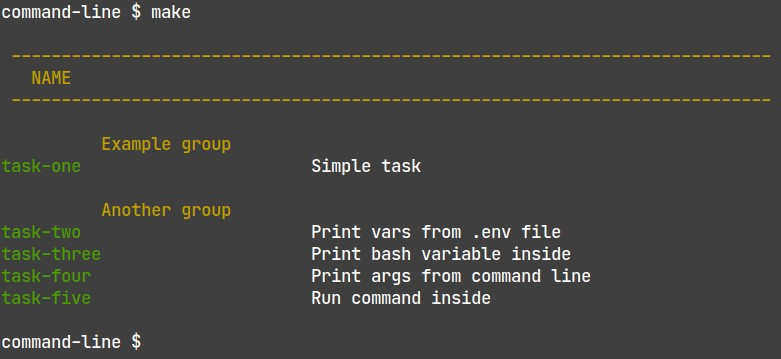

Makefile-automation
===================

Makefile template for automation in projects. Create tasks instead repeating it every time and forget long commands.


Demo
====



```bash
command-line $ make
                             
 ---------------------------------------------------------------------------- 
   NAME                      
 ---------------------------------------------------------------------------- 
                             
          Example group      
task-one                       Simple task
                             
          Another group      
task-two                       Print vars from .env file
task-three                     Print bash variable inside
task-four                      Print args from command line
task-five                      Run command inside
```


Description of Makefile content
===============================

First part
```bash
.RECIPEPREFIX +=                    # By default Makefile use tabs in indentation. This command allow to use SPACES
.ONESHELL:                          # By default every line in every task in ran in separate shell. Thanks to this command, there is one shell per task
SHELL:=/bin/bash                    # By default Makefile use /bin/sh
.SHELLFLAGS := -eu -o pipefail -c   # It enables exiting if there will be error in pipe, eg. something | command | something_else

# optionally load env vars from .env
include .env                        # Read variables from .env. Look at task-two

args=$(filter-out $@,$(MAKECMDGOALS))   # Allows to pass arguments into make, eg. make TASK some args. Credits: https://stackoverflow.com/a/6273809
```

This part shows how to add header and divide task on groups. This is useful in help task. Look at image above.
```bash
##
## ----------------------------------------------------------------------------
##   NAME
## ----------------------------------------------------------------------------
##


#------------------------------------------#
##          Example group
#------------------------------------------#
```


```bash
task-one: ## Simple task            # task definition. You can't use number, because help task didn't show it
    @echo "This is simple task"


#------------------------------------------#
##
##          Another group
#------------------------------------------#

task-two: ## Print vars from .env file
    @echo $(somevariable)           # this is variable loaded with "include .env" 

task-three: ## Print bash variable inside
    @hello="world"                  # this is bash variable inside task
    @echo $$hello                   # print this with double $

task-four: ## Print args from command line
    @echo "run: make task-four foo bar"
    @echo $(args)                   # echo arguments passed to make, print this with $(xxx)

task-five: ## Run command inside
    @get_comment=$$(grep other .env)# run subshell
    @echo $$get_comment    
```


Thanks to help task (this is default task) we will see simple (but nice) help message with task listing
```bash
# -----------------------------   DO NOT CHANGE   -----------------------------
help:
    @grep -E '(^[a-zA-Z_-]+:.*?##.*$$)|(^##)' $(MAKEFILE_LIST) \
        | sed -e 's/^.*Makefile://g' \
        | awk 'BEGIN {FS = ":.*?## "}; {printf "\033[32m%-30s\033[0m %s\n", $$1, $$2}' \
        | sed -e 's/\[32m##/[33m/'
    @echo

%:      # do not change             # this is useful for passing args to make
    @:    # do not change           # this is useful for passing args to make

.DEFAULT_GOAL := help
```

Bash autocomplete Makefile targets
==================================

Add this into `~/.bashrc`
```bash
complete -W "\`grep -oE '^[a-zA-Z0-9_-]+:([^=]|$)' Makefile | sed 's/[^a-zA-Z0-9_-]*$//'\`" make
```